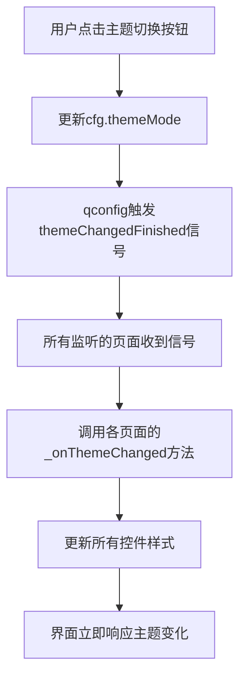

# 知秋工作平台 - 统一主题管理规范

## 📋 概述

本文档定义了整个项目的主题管理规范，确保所有界面组件在浅色/深色主题切换时保持一致的视觉效果。

## 🎨 主题管理架构

### 1. 全局配置 (`config.py`)

```python
from qfluentwidgets import Theme

# 创建全局配置对象
cfg = Config()
cfg.themeMode.value = Theme.LIGHT  # 默认使用浅色主题
```

**重要规范**：
- ✅ 默认使用 `Theme.LIGHT`（浅色主题）
- ❌ 避免使用 `Theme.AUTO`（可能导致初始化异常）
- 通过 `qconfig` 监听主题变化

### 2. YOLO模块主题管理 (`YOLO/yolo_theme.py`)

YOLO模块有独立的主题样式管理文件，提供统一的样式获取方法。

#### 核心函数

```python
from qfluentwidgets import isDarkTheme, themeColor

# 颜色获取函数
get_background_color()        # 主背景色
get_card_background_color()   # 卡片背景色
get_border_color()            # 边框颜色
get_text_color()              # 主文字颜色
get_secondary_text_color()    # 次要文字颜色
get_theme_color_alpha(alpha)  # 主题色（带透明度）

# 样式获取函数
get_frame_style()             # QFrame样式
get_push_button_style()       # QPushButton样式
get_primary_button_style()    # PrimaryPushButton样式
get_combo_box_style()         # QComboBox样式
get_spin_box_style()          # QSpinBox/QDoubleSpinBox样式
get_label_style()             # QLabel样式
get_text_edit_style()         # QTextEdit样式
get_progress_bar_style()      # QProgressBar样式
get_list_widget_style()       # QListWidget样式
```

#### 主题适配工具

```python
# 为单个控件应用主题
apply_theme_to_widget(widget)

# 为整个页面应用主题（遍历所有子控件）
apply_theme_to_page(page_widget)
```

## 🔧 使用规范

### 1. 页面级主题适配

#### 标准模式

```python
from qfluentwidgets import qconfig

class MyPage(QWidget):
    def __init__(self, parent=None):
        super().__init__(parent)
        self.initUI()
        
        # 监听主题变化
        qconfig.themeChangedFinished.connect(self._onThemeChanged)
        
        # 应用初始主题
        self._onThemeChanged()
    
    def _onThemeChanged(self):
        """主题变化时更新所有控件样式"""
        # 方案1：使用统一工具（推荐）
        from YOLO.yolo_theme import apply_theme_to_page
        apply_theme_to_page(self)
        
        # 方案2：手动更新（精确控制）
        self.myFrame.setStyleSheet(get_frame_style())
        self.myButton.setStyleSheet(get_push_button_style())
        # ... 其他控件
```

### 2. 控件初始化规范

#### ✅ 推荐方式

```python
from YOLO.yolo_theme import get_push_button_style, get_label_style

# 创建控件时直接应用主题样式
self.myButton = QPushButton("按钮文本")
self.myButton.setStyleSheet(get_push_button_style())

self.myLabel = QLabel("标签文本")
self.myLabel.setStyleSheet(get_label_style())
```

#### ❌ 避免硬编码

```python
# ❌ 不要硬编码颜色
self.myLabel = QLabel("标签文本")
self.myLabel.setStyleSheet("color: #ffffff;")  # 无法响应主题切换

# ✅ 使用主题函数
self.myLabel.setStyleSheet(get_label_style())
```

### 3. YOLO模块专用规范

#### 导入主题函数

```python
from .yolo_theme import (
    get_frame_style,
    get_push_button_style,
    get_combo_box_style,
    get_label_style,
    # ... 按需导入
)
```

#### 页面主题监听

```python
class YOLOCustomPage(QWidget):
    def __init__(self, parent=None):
        super().__init__(parent)
        self.init_ui()
        
        # 监听主题变化
        qconfig.themeChangedFinished.connect(self._onThemeChanged)
    
    def _onThemeChanged(self):
        """主题切换时更新样式"""
        # 更新所有控件
        for btn in [self.btn1, self.btn2, self.btn3]:
            btn.setStyleSheet(get_push_button_style())
        
        for combo in [self.combo1, self.combo2]:
            combo.setStyleSheet(get_combo_box_style())
```

### 4. 主界面主题适配

#### HomeInterface 模式

```python
class HomeInterface(ScrollArea):
    def hideEvent(self, a0):
        """页面隐藏时清理资源"""
        if self.bannerCard:
            self.bannerCard.cleanup()
        super().hideEvent(a0)
    
    def showEvent(self, a0):
        """页面显示时重启资源"""
        super().showEvent(a0)
        # 重启定时器等资源
```

## 📐 颜色规范

### 浅色主题

| 用途 | 颜色值 | 说明 |
|-----|-------|------|
| 主背景 | `#ffffff` | 页面主背景 |
| 卡片背景 | `#f5f5f5` | Frame、Card背景 |
| 边框 | `#e0e0e0` | 边框和分隔线 |
| 主文字 | `#000000` | 标题、正文 |
| 次要文字 | `#606060` | 提示、说明文字 |
| 主题色 | `#0078d7` | 强调、选中状态 |

### 深色主题

| 用途 | 颜色值 | 说明 |
|-----|-------|------|
| 主背景 | `#1e1e1e` | 页面主背景 |
| 卡片背景 | `#2d2d2d` | Frame、Card背景 |
| 边框 | `#3d3d3d` | 边框和分隔线 |
| 主文字 | `#ffffff` | 标题、正文 |
| 次要文字 | `#aaaaaa` | 提示、说明文字 |
| 主题色 | `#0078d7` | 强调、选中状态 |

## 🛠️ 常见控件样式示例

### QPushButton 普通按钮

```python
self.myButton = QPushButton("按钮文本")
self.myButton.setStyleSheet(get_push_button_style())

# 特点：
# - 自动响应hover、pressed、disabled状态
# - 跟随主题切换背景色和文字色
# - 圆角6px，padding 8px 16px
```

### PrimaryPushButton 主要按钮

```python
from qfluentwidgets import PrimaryPushButton

self.primaryBtn = PrimaryPushButton("确定")
self.primaryBtn.setStyleSheet(get_primary_button_style())

# 特点：
# - 始终使用主题蓝色 (#0078d7)
# - 白色文字
# - 更醒目的视觉效果
```

### QComboBox 下拉框

```python
self.myCombo = QComboBox()
self.myCombo.setStyleSheet(get_combo_box_style())

# 特点：
# - 下拉列表背景自动适配主题
# - 选中项使用主题色高亮
# - 边框颜色跟随主题
```

### QFrame 容器

```python
self.containerFrame = QFrame()
self.containerFrame.setStyleSheet(get_frame_style())

# 特点：
# - 圆角8px
# - 自动适配卡片背景色
# - 1px边框，颜色跟随主题
```

## 📊 完整页面示例

```python
from PyQt6.QtWidgets import QWidget, QVBoxLayout, QHBoxLayout, QPushButton, QLabel, QComboBox
from qfluentwidgets import qconfig
from YOLO.yolo_theme import (
    get_frame_style, get_push_button_style, 
    get_combo_box_style, get_label_style
)

class CustomPage(QWidget):
    def __init__(self, parent=None):
        super().__init__(parent)
        self.initUI()
        
        # 监听主题变化
        qconfig.themeChangedFinished.connect(self._onThemeChanged)
        
        # 应用初始主题
        self._onThemeChanged()
    
    def initUI(self):
        layout = QVBoxLayout(self)
        
        # 标题
        self.titleLabel = QLabel("页面标题")
        self.titleLabel.setStyleSheet("font-size: 18px; font-weight: bold;")
        layout.addWidget(self.titleLabel)
        
        # 控制区域
        controlLayout = QHBoxLayout()
        
        self.selectBtn = QPushButton("选择文件")
        self.selectBtn.setStyleSheet(get_push_button_style())
        controlLayout.addWidget(self.selectBtn)
        
        self.typeCombo = QComboBox()
        self.typeCombo.addItems(["类型1", "类型2", "类型3"])
        self.typeCombo.setStyleSheet(get_combo_box_style())
        controlLayout.addWidget(self.typeCombo)
        
        layout.addLayout(controlLayout)
    
    def _onThemeChanged(self):
        """主题变化时更新样式"""
        self.titleLabel.setStyleSheet(f"font-size: 18px; font-weight: bold; {get_label_style()}")
        self.selectBtn.setStyleSheet(get_push_button_style())
        self.typeCombo.setStyleSheet(get_combo_box_style())
```

## ⚠️ 常见错误

### 1. 硬编码颜色

```python
# ❌ 错误
label.setStyleSheet("color: #ffffff;")

# ✅ 正确
label.setStyleSheet(get_label_style())
```

### 2. 忘记监听主题变化

```python
# ❌ 错误 - 只在初始化时设置样式
def __init__(self):
    self.button.setStyleSheet(get_push_button_style())

# ✅ 正确 - 监听主题变化并更新
def __init__(self):
    self.button.setStyleSheet(get_push_button_style())
    qconfig.themeChangedFinished.connect(self._onThemeChanged)

def _onThemeChanged(self):
    self.button.setStyleSheet(get_push_button_style())
```

### 3. 混用不同样式系统

```python
# ❌ 错误 - 混用硬编码和主题函数
self.label1.setStyleSheet("color: white;")  # 硬编码
self.label2.setStyleSheet(get_label_style())  # 主题函数

# ✅ 正确 - 统一使用主题函数
self.label1.setStyleSheet(get_label_style())
self.label2.setStyleSheet(get_label_style())
```

## 🔄 主题切换流程



## 📝 检查清单

在添加新页面或修改现有页面时，请确保：

- [ ] 所有按钮使用 `get_push_button_style()` 或 `get_primary_button_style()`
- [ ] 所有下拉框使用 `get_combo_box_style()`
- [ ] 所有标签使用 `get_label_style()`
- [ ] 所有容器Frame使用 `get_frame_style()`
- [ ] 页面监听了 `qconfig.themeChangedFinished` 信号
- [ ] 实现了 `_onThemeChanged()` 方法
- [ ] 没有硬编码任何颜色值
- [ ] 测试了浅色和深色主题的切换效果

## 🚀 扩展主题系统

### 添加新控件样式

如需为新类型控件添加主题支持，在 `yolo_theme.py` 中添加：

```python
def get_my_widget_style():
    """获取自定义控件样式"""
    if isDarkTheme():
        return """
            MyWidget {
                background-color: #2d2d2d;
                color: #ffffff;
            }
        """
    else:
        return """
            MyWidget {
                background-color: #f5f5f5;
                color: #000000;
            }
        """
```

### 使用主题色

```python
from YOLO.yolo_theme import get_theme_color_alpha

# 获取主题色，透明度30%
theme_color = get_theme_color_alpha(30)

widget.setStyleSheet(f"""
    QWidget {{
        background-color: {theme_color};
    }}
""")
```

## 📚 相关文档

- [QFluentWidgets 主题文档](https://qfluentwidgets.com/zh/pages/theme)
- [Qt样式表参考](https://doc.qt.io/qt-6/stylesheet-reference.html)
- [项目配置说明](../../../config.py)

---

**维护者**: 开发团队  
**最后更新**: 2025-10-24  
**版本**: 1.0
